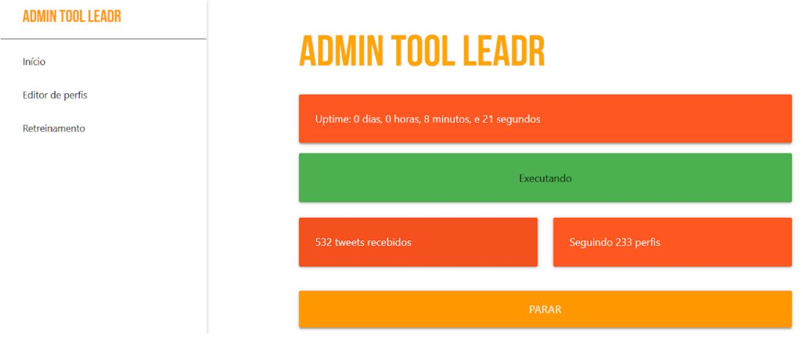
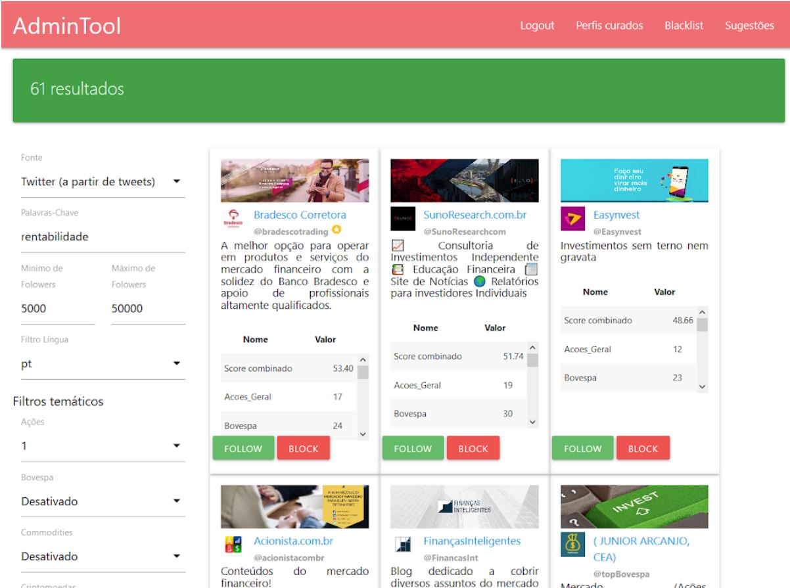
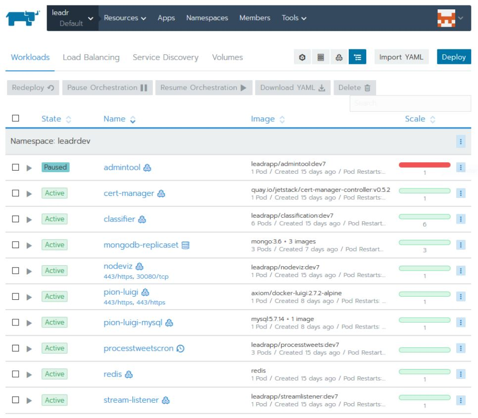

*Leadr Tweet Classifier* is a set of software components that handle the acquisition, processing, managing and storage of tweet data. 

For this project, I was the lead programmer who was responsible for programming the various ...

*ADM tool* executes scripts responsible for definitions in the Classifier through a web interface. This makes the process accessible to users unfamiliar with the command line interface.

  
  
  

You can learn more about Leadr [here](https://www.leadr.com.br/).

