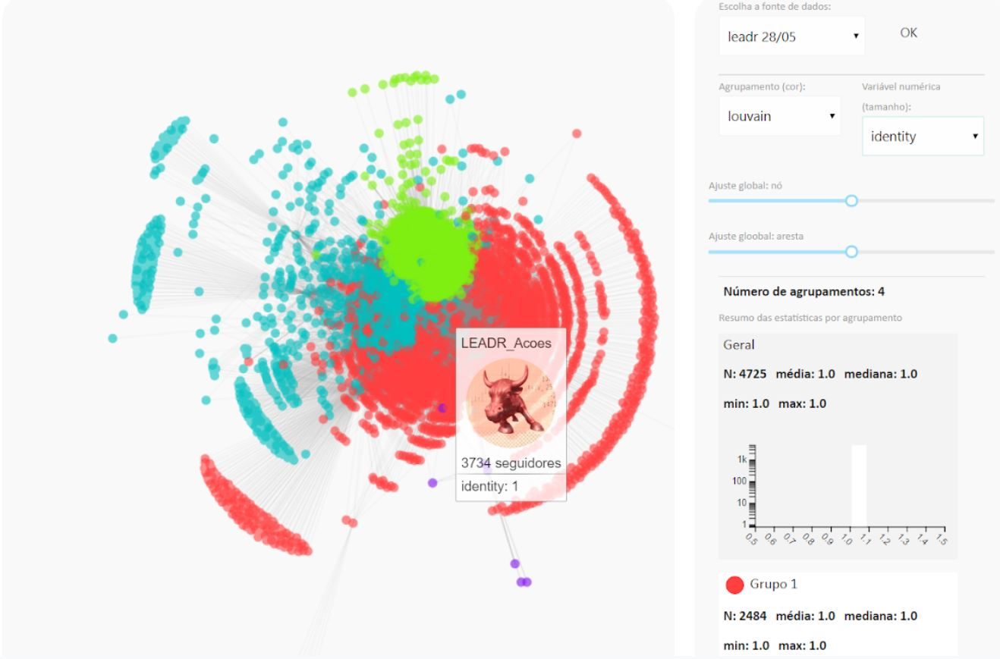
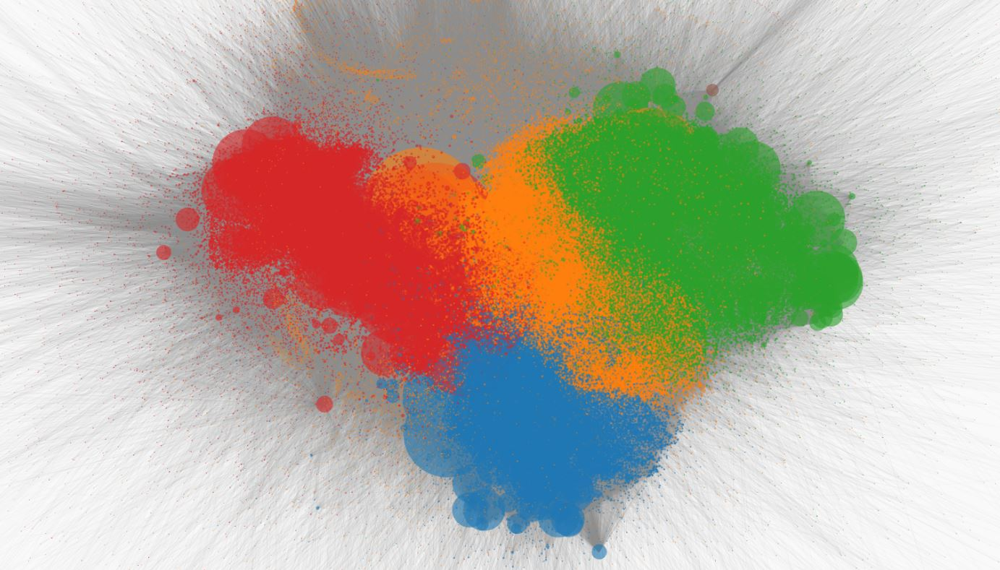

 

*Leadr Network Vis* is a web application for interactive visualization and social network analysis metrics of connection data between the Leadr Network users. It made possible to understand the distribution of users, identify the formation of clusters, and explore the patterns of relationship between users.

 
 
In this project I was the lead data scientist, responsible for the network data preparation, including MongoDB for database storage and the SNA metrics implementation. 
 
 
...I also gained experience with full-stack web application design and associated technologies. 
Optimizing canvas, D3.js the Javascript for the canva rendering to deal with a large quantity of nodes (users) of the social network.

 
 
Private code.
 
 
 
 
 
