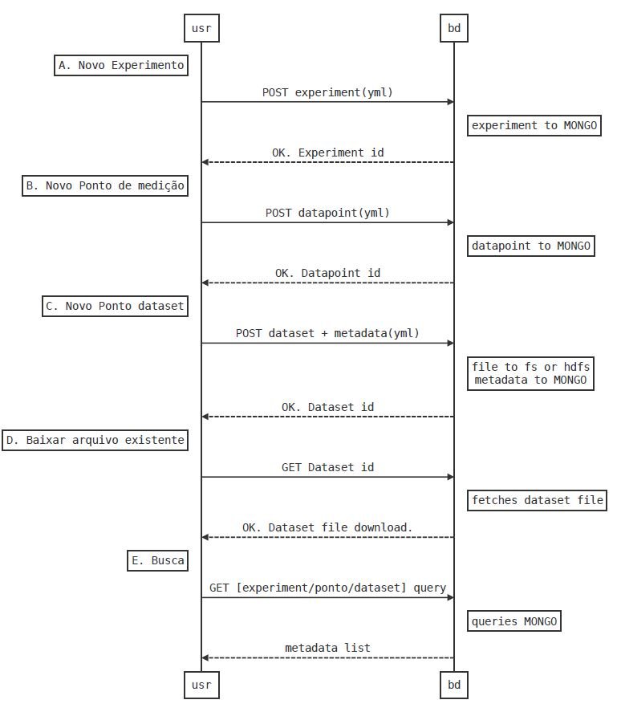
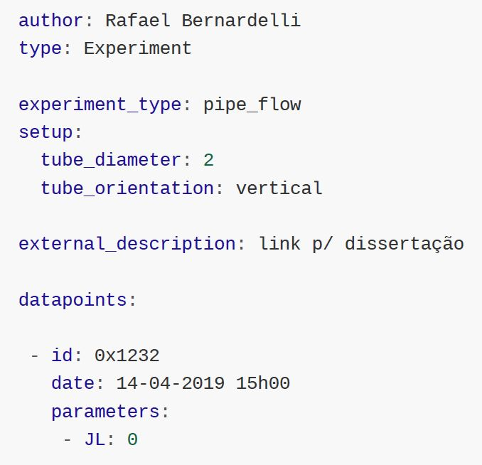
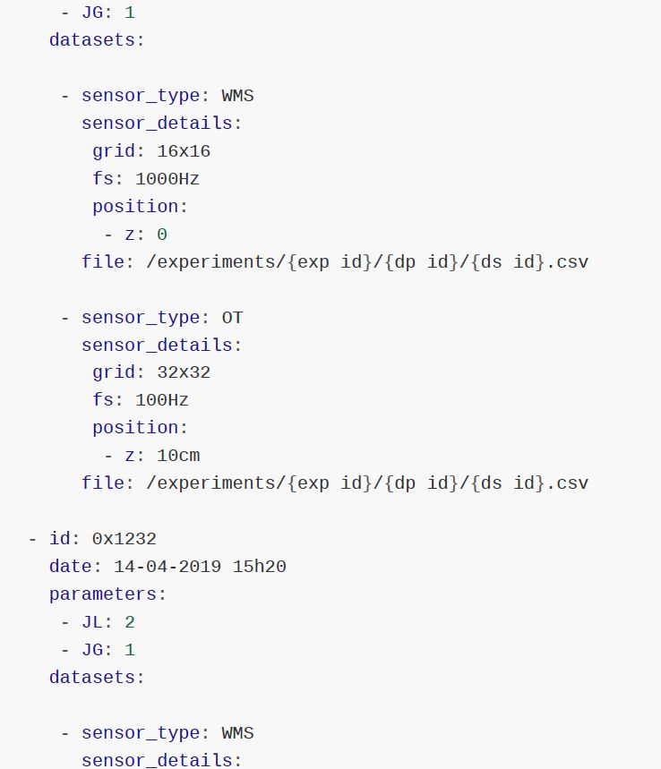

 
This project aims to create a standard storage structure suitable for any kind of experimental setup, allowing for multiple data sources and operating points, for the Multiphase Flow Research Center (NUEM-UTFPR). 
 
 
**Case diagram:** 

 
 
My proposal is to develop a server capable of managing these records, in order to enable programmatic and manual search and insertion. This project is being developed with the following tools: ...
 
 
**Metadata example:** 

 
 
 
 
 
